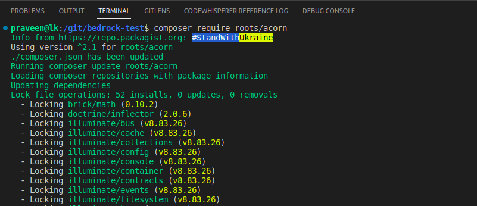
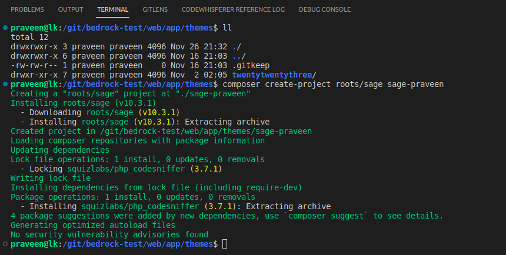
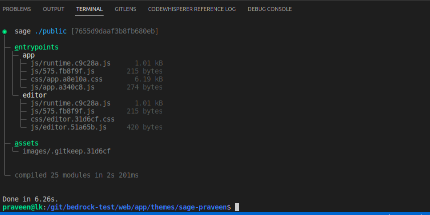

# Sage

https://roots.io/sage/


# Laravel

https://laravel.com/


# Install Acorn

`composer require roots/acorn`



# Install Sage

`composer create-project roots/sage sage-praveen`



# Yarn Build

```
yarn
yarn build
```

